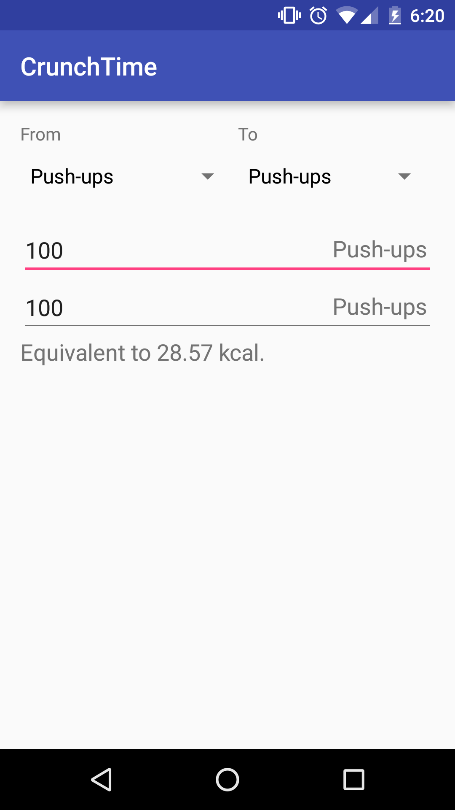
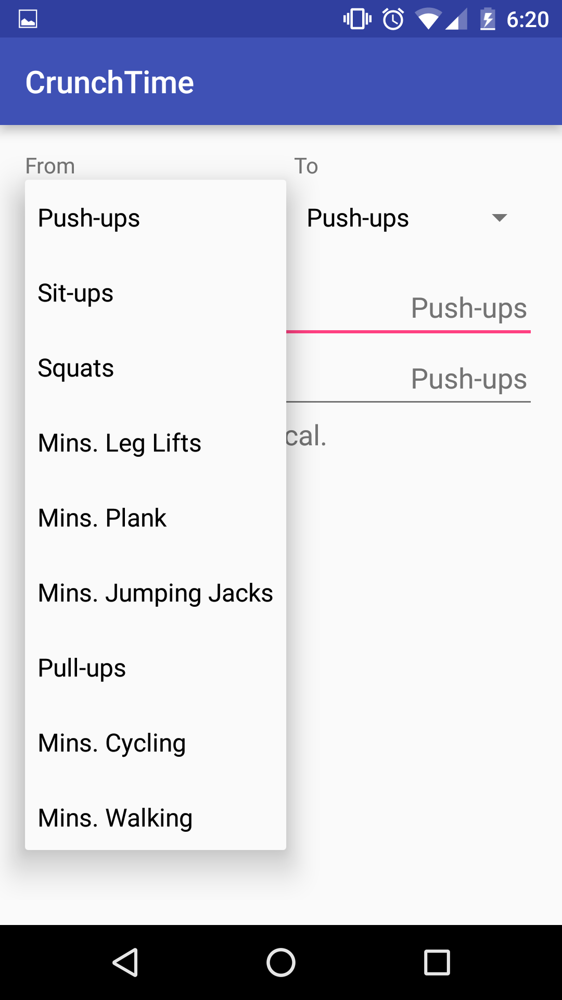
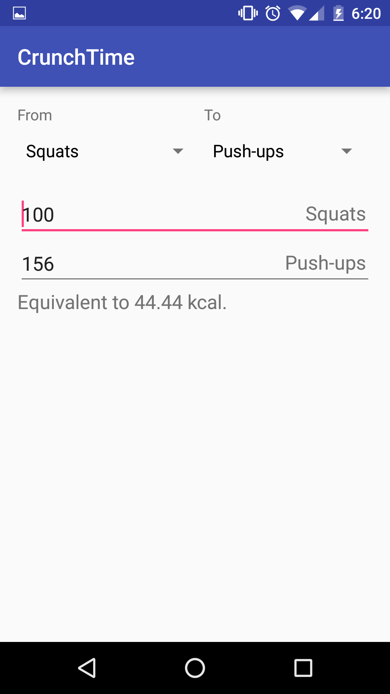
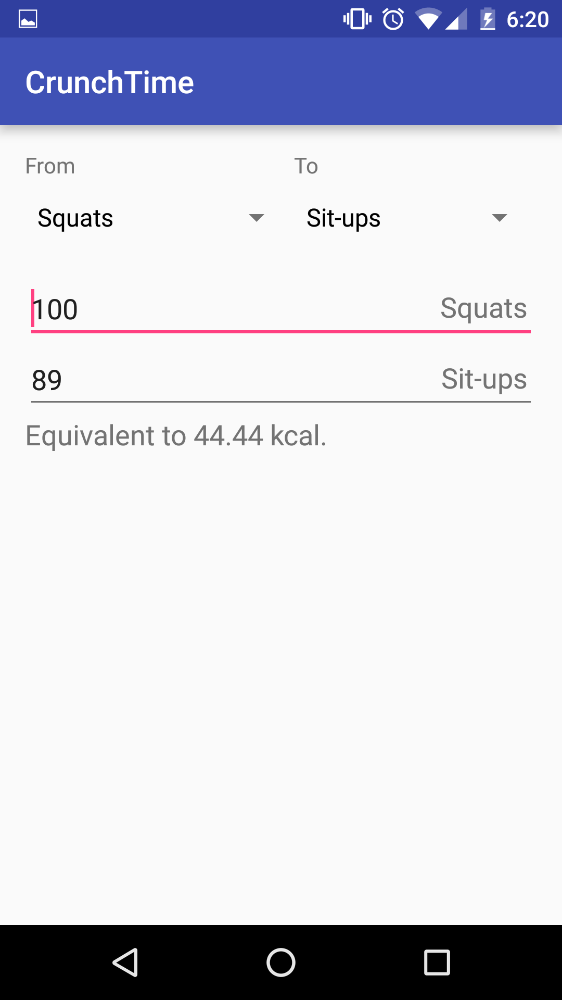
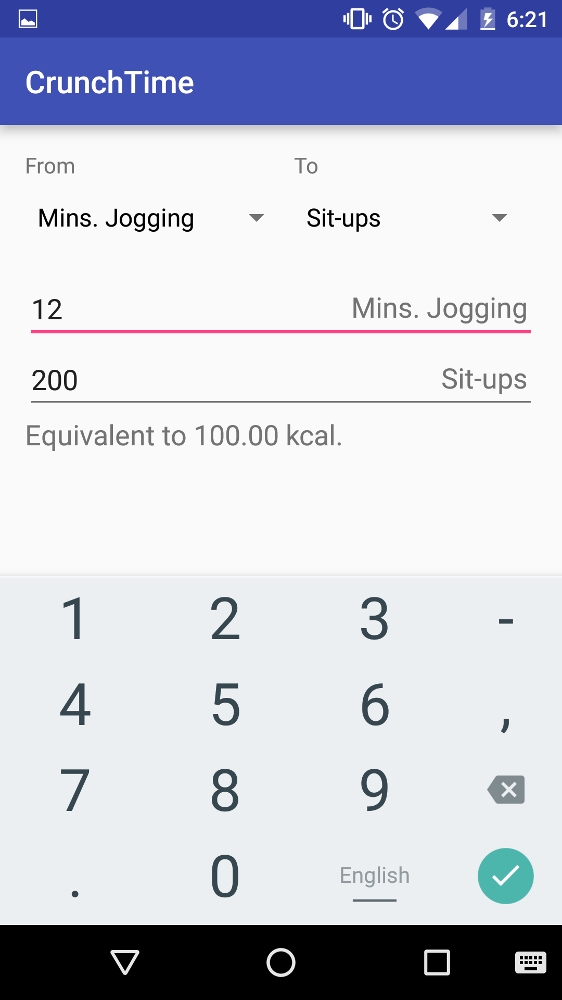

# PROG 01: Crunch Time

Convert reps and minutes to calories, and other exercises.

## Authors

Eldon Schoop

## Demo Video

Watch the _super exciting_ [demo video](https://www.youtube.com/watch?v=Dt2IQL8GXSY).

## Screenshots

 

## Acknowledgments

* Thanks to [mkyong](http://www.mkyong.com/android/android-spinner-drop-down-list-example/) and [Shine/znq](http://stackoverflow.com/questions/1337424/android-spinner-get-the-selected-item-change-event) for the spinners code reference.
